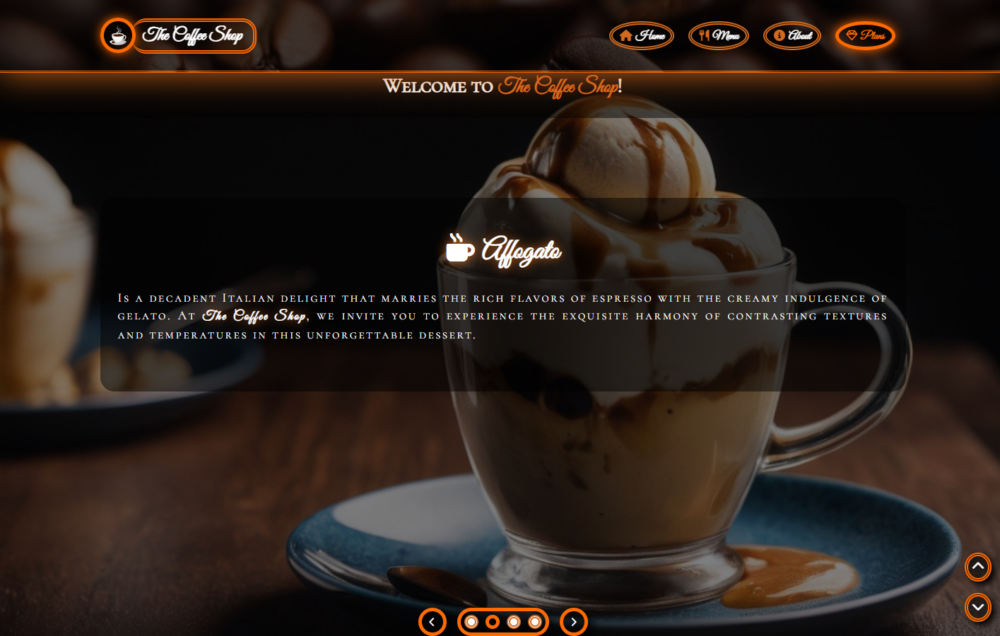

# The Coffee Shop ☕

Welcome to The Coffee Shop project! This is an HTML/CSS/JS project for a coffee shop website. It includes a responsive and highly stylish layout, with tons of accessibility features, aiming to be accessible for both sighted and non-aligned users that use assistive technologies like screen readers.

## Features 🦿🦾

### Header

- Glass/transparent/blurry effect.
- Button to hide/show the navnar.
- Button to lock the current state of the navbar.
  - Keeps it hidden if the user hides it.
  - Keeps it visible if the user expands it.
- Website branding with title and logo.
  - Expanding and rotating effect of the title on hover.
- Navigation anchors with a hover and active effect.
  - The section the user is currently on highlights the corresponding anchor.
- Login and cart buttons: user can authenticate and see what they're saving to buy later.
- Hamburger menu: for smaller screens, navbar elements appear when user clicks the hamburger menu.

### Hero section

- Hero section with a slider of drink images, including autoplay and manual sliding buttons as well as sliding indicators that are also interactive. It also includes a small description of the drink with title and the rating of clients, as well as a button to see more information about the drink being shown on the slide and another button to open the link on the app of the coffee shop.

### Menu section

- Infinite carousels of cards with coffee drinks.
- Autoplay effect for each carousel.
- Button to skip one card (left and right).
- Button to skip three cards (left and right).
- "Peeking" effect: cards overflowing the edges are partially visible, indicating more content to the user.
- "Grab to see" functionality for both desktop and mobile.
- Search form between carousels with autocomplete functionality. Opens modal with drink info.
- Clicking on a carousel card opens a modal with info about the drink.

### Special section

- Special section with special drinks for users that acquired a plan. This section resembles the hero section, but each slide has its own color scheme, and the section changes its scheme every time the slide changes. Sticky elements also change color scheme accordingly when they're visible on top of this section.

### Plans section
 
- Plans section where the user can see the plans offered by the coffee shop and acquire them. It includes prices, benefits, comparison between each plan, and a lot of interaction, like a dropdown menu to choose options like "pay $X/month" or "pay $Y/year", as well as a lot of animations and visual effects.

### Footer

- Navigation anchors.
- Links to social media.
- App links on Google play store and iOS app store.
- Copyright message of The Coffee Shop.

## How to access 🔗

To access The Coffee Shop, just [CLICK HERE](https://filipe-2.github.io/the-coffee-shop/) or type [filipe-2.github.io/the-coffee-shop](https://filipe-2.github.io/the-coffee-shop/) on your browser and hit enter.

## Preview

