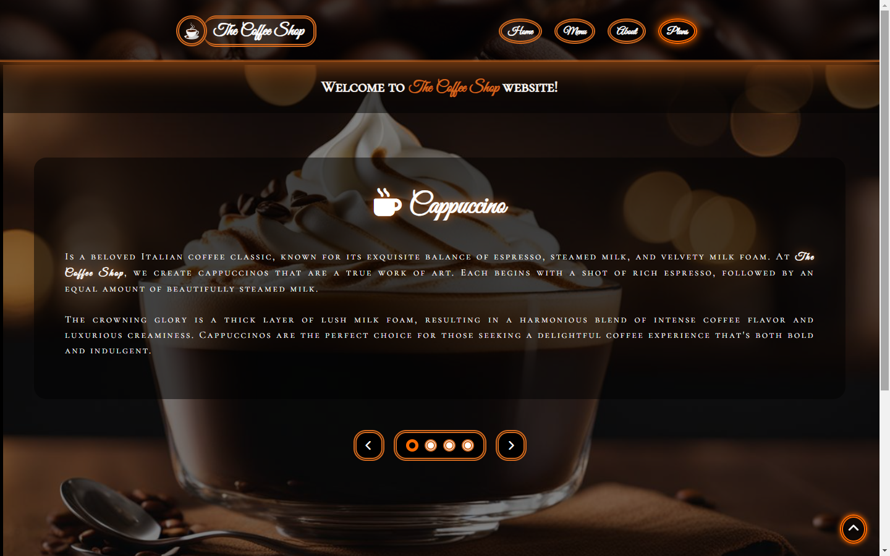

# The Coffee Shop

Welcome to The Coffee Shop project! This is a simple HTML/CSS/JS project for a coffee shop website.

## Description

The Coffee Shop project consists of HTML and CSS files that create a static website for a coffee shop. It includes a homepage, menu, about page, and plans section.

## Features

- Homepage with showcase section
- Menu page
- About page
- Plans section in the navigation bar
- Much more

## Usage

To view the website, follow [this link](https://filipe-2.github.io/TheCoffeeShop/).
## Preview

Header and showcase section

Showcase section and footer

