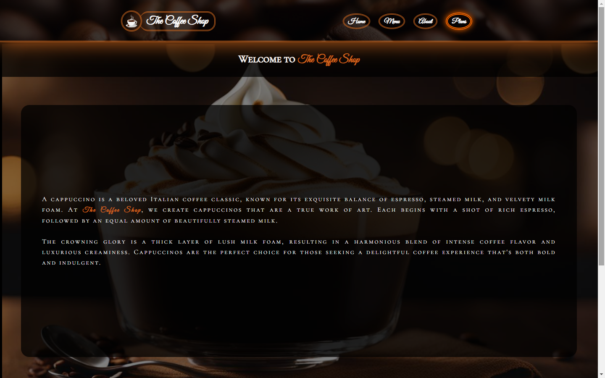
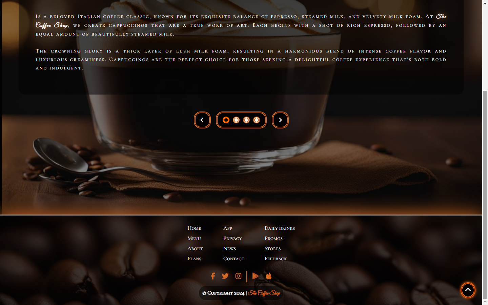

# The Coffee Shop

Welcome to The Coffee Shop project! This is a simple HTML/CSS/JS project for a coffee shop website.

## Description

The Coffee Shop project consists of HTML and CSS files that create a static website for a coffee shop. It includes a homepage, menu, about page, and plans section.

## Features

- Homepage with showcase section
- Menu page
- About page
- Plans section in the navigation bar
- Much more

## Usage

To view the website locally, follow these steps:

### Option 1: Download and extract the repository

1. **Download the repository**: Click on the "Code" button above and select "Download ZIP".
2. **Extract the downloaded ZIP file**: Once the download is complete, extract the contents of the ZIP file to a folder on your computer.

3. **Navigate to the project directory**: Open the extracted folder and navigate to the project directory using your file explorer.

4. **Open the `index.html` file**: Double-click the `index.html` file to open it in your preferred web browser.

### Option 2: Clone the repository (if you have Git installed)

1. **Clone the repository**: Open your terminal and run the following command to clone the repository to your local machine:
   
   ```bash
   git clone https://github.com/filipe-2/TheCoffeeShop.git

2. Navigate to the project directory and open the `index.html` file.

## Preview

Header and showcase section



Showcase section and footer


