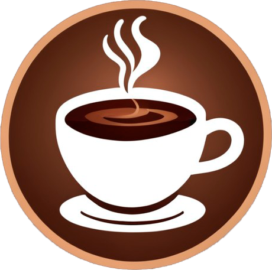
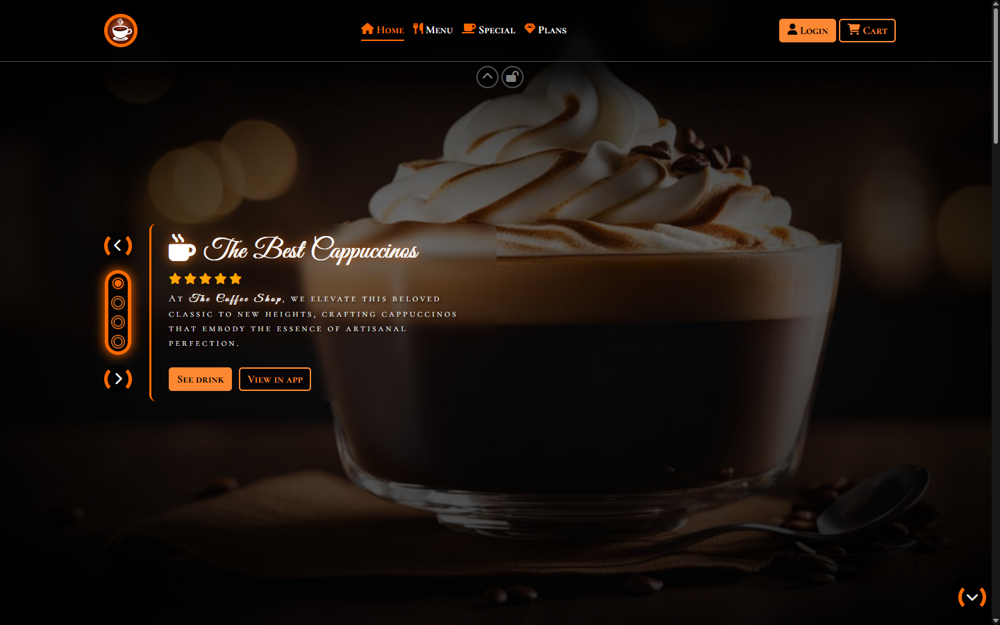
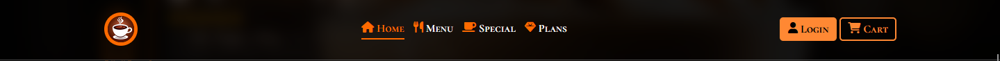
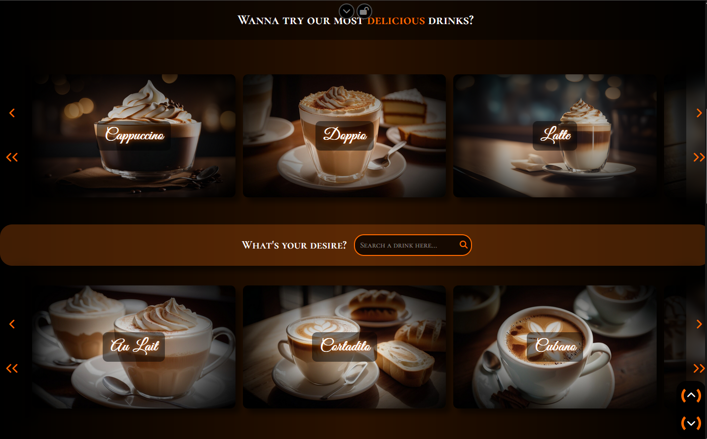
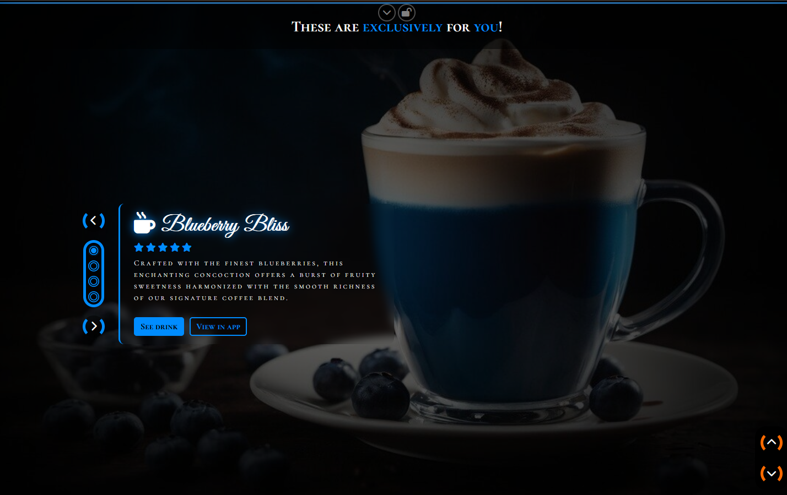
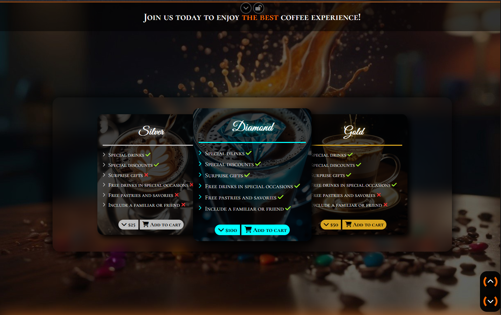
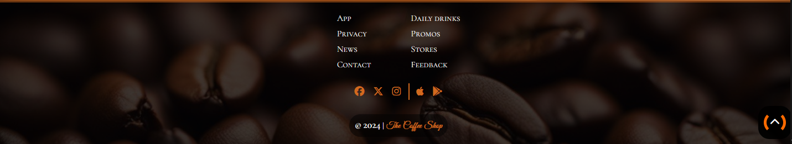

    
    <h1 align="center">The Coffee Shop</h1>

Welcome to The Coffee Shop project! This is an HTML/CSS/JS project for a coffee shop website. It includes a responsive and highly stylish layout, with tons of accessibility features, aiming to be accessible for both sighted and non-sighted users that use assistive technologies like screen readers.

## Preview

## Features 🦿🦾

### Header

- Glass/transparent/blurry effect.
- Button to hide/show the navnar.
- Button to lock the current state of the navbar.
  - Keeps it hidden if the user hides it.
  - Keeps it visible if the user expands it.
- Website branding with title and logo.
  - Expanding and rotating effect of the title on hover.
- Navigation anchors with a hover and active effect.
  - The section the user is currently on highlights the corresponding anchor.
- Login and cart buttons: user can authenticate and see what they're saving to buy later.
- Hamburger menu: for smaller screens, navbar elements appear when user clicks the hamburger menu.

### Hero section

- Fullscreen slider of drink images.
  - Autoplay effect.
  - Manual sliding buttons.
  - Interactive slide indicators.
  - Description of drinks with titles and ratings of clients.
  - Button to see more info about the drink being shown.
  - Button to open the drink on the app of The Coffee Shop (if installed).

### Menu section

- Infinite carousels of cards with coffee drinks.
  - Autoplay effect for each carousel.
  - Button to skip one card (left and right).
  - Button to skip three cards (left and right).
  - "Peeking" effect: cards overflowing the edges are partially visible, indicating more content to the user.
  - "Grab" functionality for both desktop and mobile.
  - Search form between carousels with autocomplete functionality. Opens modal with drink info.
  - Clicking on a carousel card opens a modal with info about the drink.

### Special section

- Special drinks for users that acquired a plan.
- Same layout used for the hero section.
- Each slide has its own color scheme.
  - Changing a slide changes the color scheme of the section.
  - Sticky elements also change color scheme when on top of the section.

### Plans section

- Cards with plans that the user can acquire.
  - Silver, gold, and diamond plans.
  - Prices, benefits, and comparisons between each plan.
  - Dropdown for payment customization (e.g., $X/month or $Y/year).
  - Card animations.

### Footer

- Navigation anchors.
- Links to social media.
- Links to app on Google play and App store.
- Copyright message of The Coffee Shop.

## How to access 🔗

To access The Coffee Shop, just [click here](https://filipe-2.github.io/the-coffee-shop/) or type [filipe-2.github.io/the-coffee-shop](https://filipe-2.github.io/the-coffee-shop/) on your browser and hit enter.
