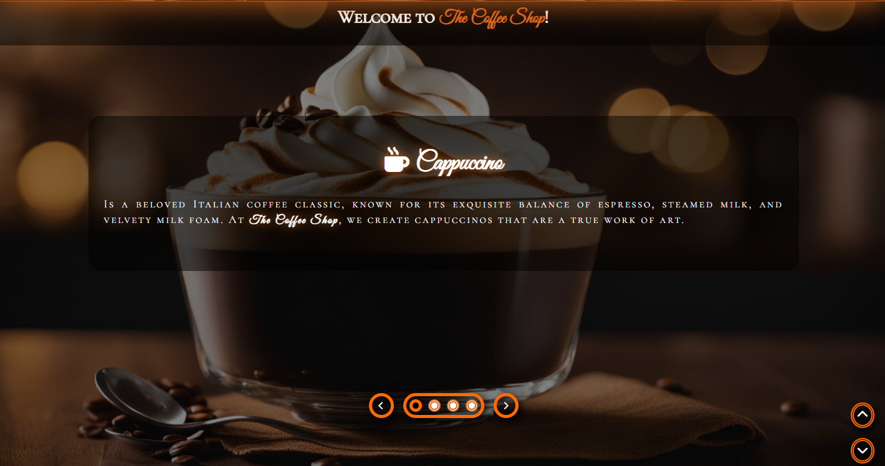
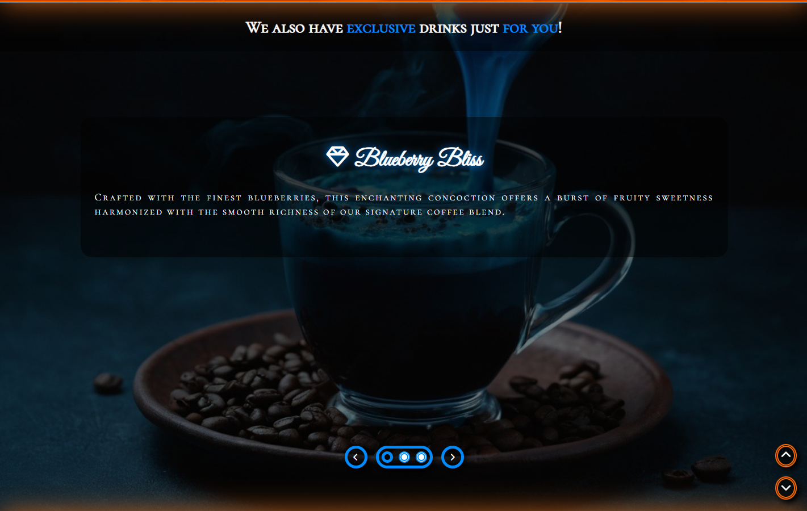
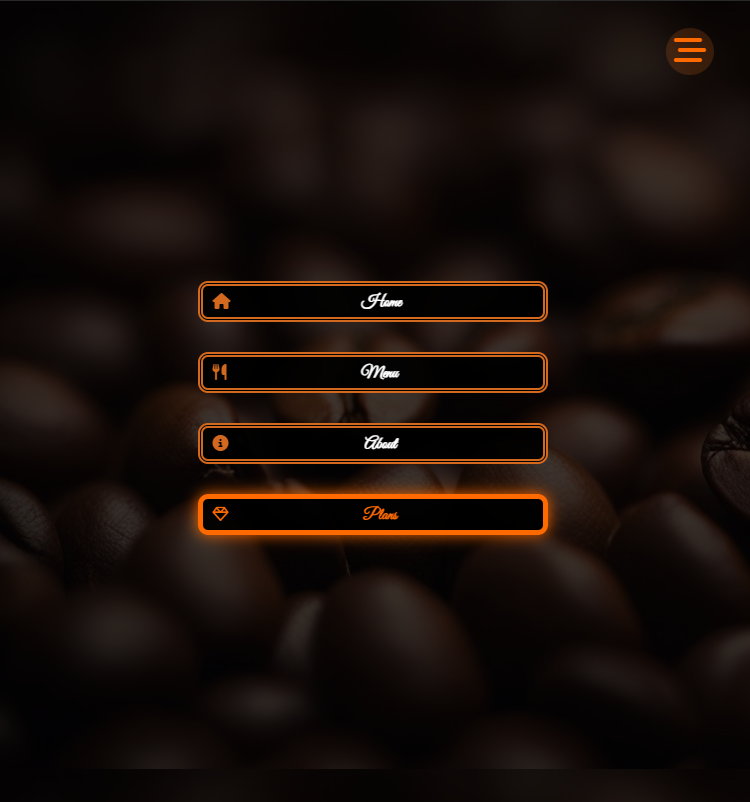

# The Coffee Shop

Welcome to The Coffee Shop project! This is a simple HTML/CSS/JS project for a coffee shop website.

## Description

This repository consists of the HTML, CSS, and JS files of a website for a coffee shop. It includes a homepage, menu, about page, and plans page.

## Features

- Homepage with header, showcase, drinks, special drinks, plans, and footer sections;
- Menu page;
- About page;
- Plans page;
- Much more.

## Usage

To access the website, just follow [this link](https://filipe-2.github.io/TheCoffeeShop/).

## Preview

